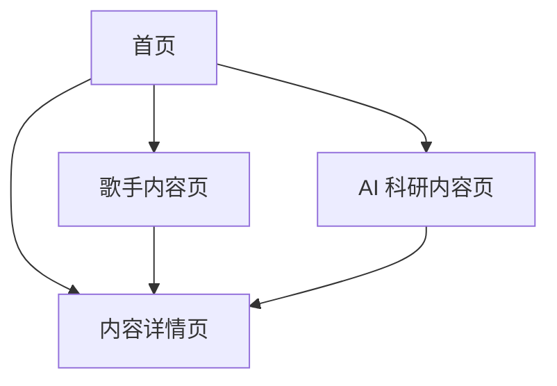

## 1. Product Overview
一个支持 GitHub Pages 静态部署的个人网站，包含两条内容主线：歌手相关内容与 AI 科研内容。
面向访客浏览与分享；你通过“提交内容文件到仓库”的方式快速上新论文/专辑/周边/巡演等内容。

## 2. Core Features

### 2.1 User Roles
| 角色 | 注册方式 | 核心权限 |
|------|---------|----------|
| 访客 | 无需注册 | 浏览与分享全部公开内容 |
| 站点维护者（你） | 无需站内注册（通过 Git 提交内容） | 新增/修改/下架内容；调整首页推荐与置顶 |

### 2.2 Feature Module
网站由以下核心页面组成：
1. **首页**：双线入口导航、最新更新与置顶推荐、全站搜索。
2. **歌手内容页**：专辑/周边/巡演三类内容的切换浏览、筛选与排序、条目卡片列表。
3. **AI 科研内容页**：论文列表、筛选与排序、条目卡片列表。
4. **内容详情页**：展示单条论文/专辑/周边/巡演的完整信息与外链跳转。

### 2.3 Page Details
| Page Name | Module Name | Feature description |
|-----------|-------------|---------------------|
| 首页 | 顶部导航 | 进入“歌手内容”“AI 科研”；提供全站搜索入口 |
| 首页 | 双线推荐区 | 展示置顶推荐（可配置）；展示最新更新（按时间排序） |
| 首页 | 全站搜索 | 按关键字搜索标题/标签/摘要；在结果中跳转详情 |
| 歌手内容页 | 类型切换 | 在“专辑/周边/巡演”三类之间切换浏览 |
| 歌手内容页 | 列表浏览 | 以卡片列表展示条目（封面/标题/时间/标签/一句话摘要） |
| 歌手内容页 | 筛选与排序 | 按年份/标签筛选；按发布时间或事件时间排序 |
| AI 科研内容页 | 列表浏览 | 以卡片列表展示论文（标题/作者/会议期刊/年份/标签/摘要） |
| AI 科研内容页 | 筛选与排序 | 按年份/会议期刊/标签筛选；按年份或更新时间排序 |
| 内容详情页 | 内容正文展示 | 展示图文与关键信息字段；支持 Markdown 渲染 |
| 内容详情页 | 外链与下载 | 跳转论文 PDF/代码仓库；跳转专辑平台；周边购买链接；巡演购票链接 |
| 内容详情页 | 上下篇/返回 | 返回列表；可选展示同类内容的上一条/下一条（基于排序规则） |

## 3. Core Process
- 访客浏览流程：
  1) 进入首页，选择“歌手内容”或“AI 科研”，或直接搜索。 
  2) 在对应列表页通过筛选/排序找到感兴趣条目。 
  3) 进入详情页阅读并通过外链跳转到论文/专辑平台/购买/购票等。

- 你（维护者）更新内容流程（无需站内后台）：
  1) 在仓库的内容目录新增/修改一个内容文件（如 `content/research/papers/*.md` 或 `content/singer/albums/*.md`）。
  2) 提交并推送到主分支后，站点重新构建发布；首页“最新更新”自动变化，置顶推荐通过配置文件控制。

