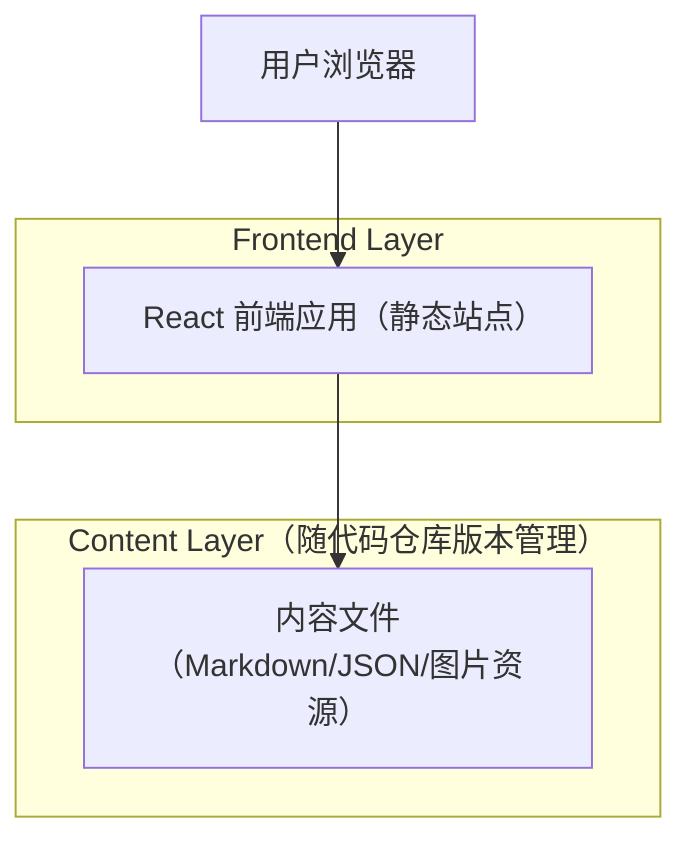

## 1.Architecture design

## 2.Technology Description
- Frontend: React@18 + vite + react-router-dom + tailwindcss
- Content Rendering: Markdown（remark/rehype 或 MDX 二选一）+ 代码高亮（可选）
- Backend: None（纯静态，适配 GitHub Pages）

## 3.Route definitions
| Route | Purpose |
|-------|---------|
| / | 首页：双线入口、推荐、最新、全站搜索 |
| /singer | 歌手内容页：专辑/周边/巡演列表与筛选 |
| /research | AI 科研内容页：论文列表与筛选 |
| /item/:type/:slug | 内容详情页：展示单条内容（论文/专辑/周边/巡演） |

## 6.Data model(if applicable)
### 6.1 Data model definition
本项目不引入数据库；数据以“内容文件 + 元信息（frontmatter/JSON）”形式存在并随 Git 版本管理。

建议的内容元信息（逻辑字段，便于统一渲染与搜索）：
- 公共字段：id/slug、title、summary、tags、coverImage、publishedAt、updatedAt、externalLinks[]
- singer/albums：artist、releaseDate、tracklist（可选）、platformLinks
- singer/merch：price（可选）、buyLinks、availabilityStatus
- singer/tours：eventDate、city/venue、ticketLinks
- research/papers：authors、venue、year、pdfUrl、codeUrl（可选）

### 6.2 Data Definition Language
无（不使用数据库）。
